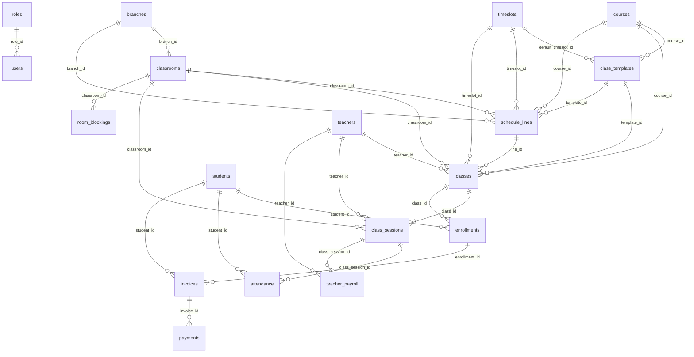
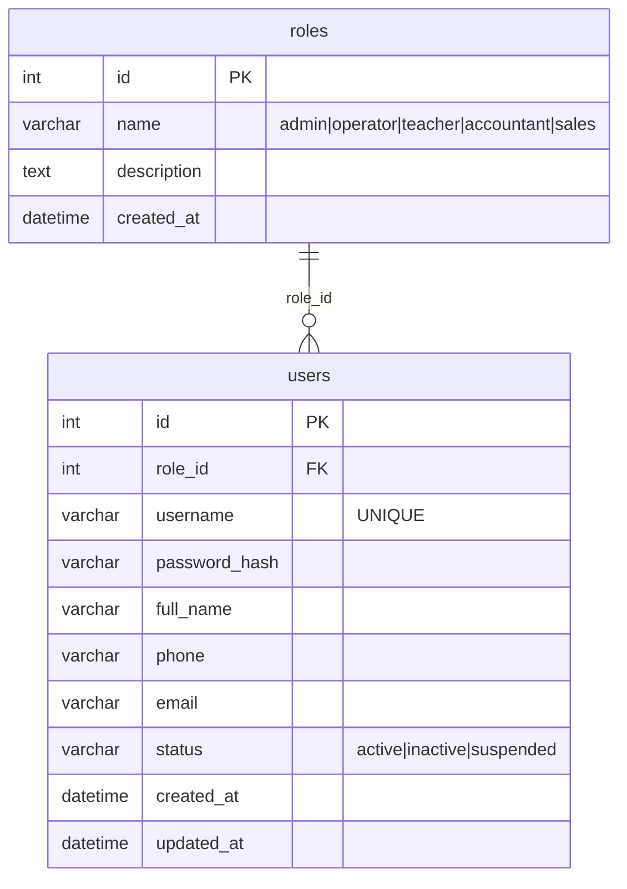
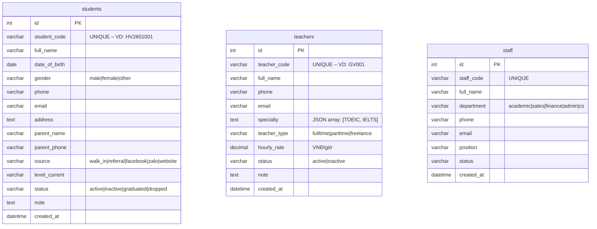
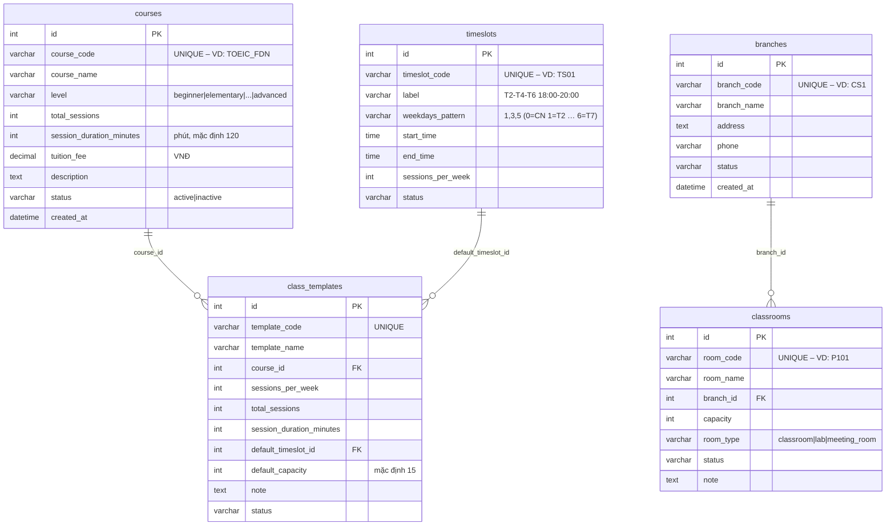
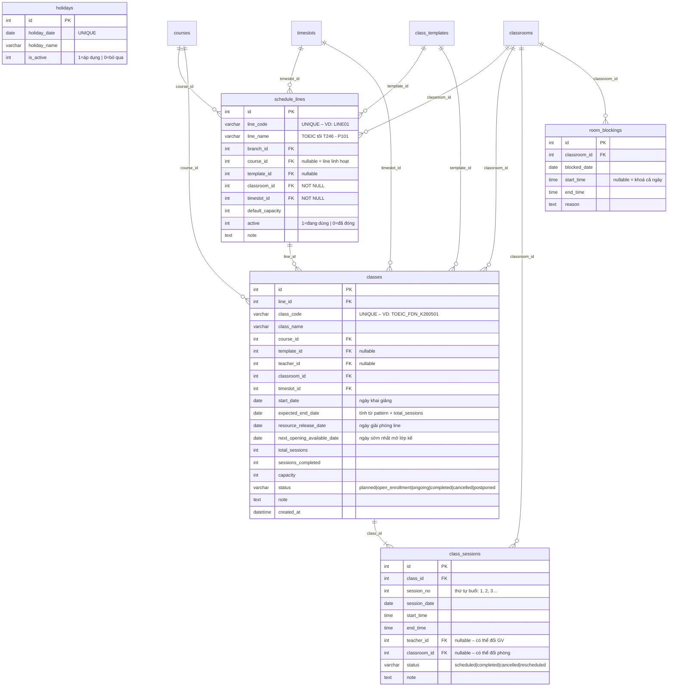
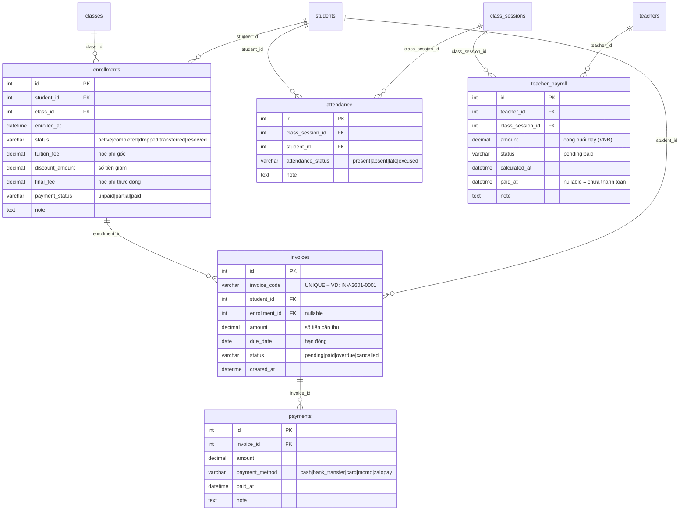
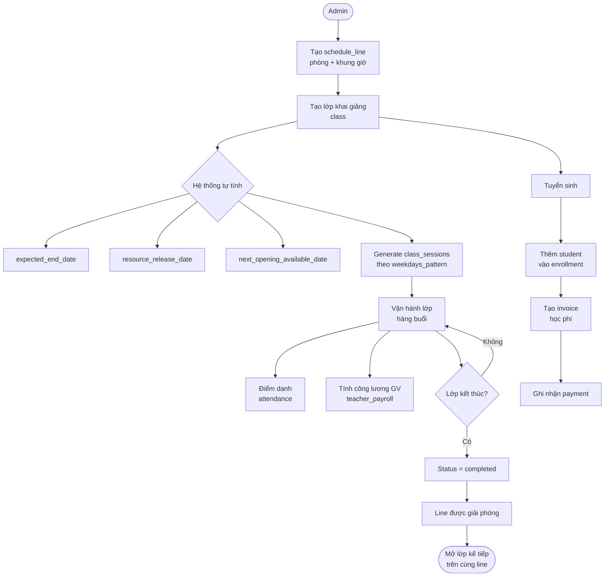

# ERD — HRM System Database

---

## Diagram 1: Tổng quan quan hệ (không có cột)

Dùng để nắm nhanh toàn bộ cấu trúc và hướng quan hệ giữa các bảng.

---

## Diagram 2: Nhóm Người dùng & Phân quyền

---

## Diagram 3: Nhóm Nhân sự

---

## Diagram 4: Nhóm Master Data học thuật

---

## Diagram 5: Nhóm Scheduling (lõi xếp lịch)

Đây là nhóm quan trọng nhất của hệ thống.

---

## Diagram 6: Nhóm Giao dịch vận hành

---

## Diagram 7: Luồng vận hành end-to-end

Sơ đồ dạng flowchart mô tả nghiệp vụ từ tạo lớp đến kết thúc.

---

## Ghi chú ký hiệu Mermaid ERD

| Ký hiệu | Nghĩa |
|---------|-------|
| `\|\|--o{` | 1 bắt buộc — 0 hoặc nhiều |
| `\|\|--\|{` | 1 bắt buộc — 1 hoặc nhiều |
| `\|\|--\|\|` | 1 bắt buộc — 1 bắt buộc |
| `PK` | Primary Key |
| `FK` | Foreign Key |
